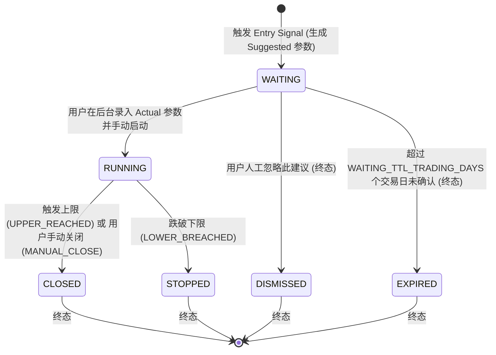

# NDX Nasdaq-100 Long-Only Futures/Perpetual Arithmetic Grid Reminder System

一个基于 FastAPI + APScheduler + Pandas 的 **NDX（Nasdaq-100）做多算术网格人工辅助提醒/监控系统**。

> [!IMPORTANT]
> **定位与边界声明**：
> 本系统为**人工辅助提醒与监控系统**，**不连接任何交易所 API、不自动交易、不自动下单、不自动平仓、不计算真实交易所 PnL 与强平点（Liquidation）**。系统的“理论网格状态”仅用于辅助提醒与决策参考，实际网格操作需由用户在交易所手动完成。

- **标的**：`^NDX`（Nasdaq-100 指数，对应期货/永续合约做多网格）
- **方向**：Long-Only（纯做多等差网格）
- **网格类型**：算术（等差）网格
- **默认建议参数**（可由 `DEFAULT_GRID_*` 环境变量或数据库覆盖，线上实际值可能不同）：Upper = 基准价 +20%，Lower = 基准价 -20%，200 格，建议杠杆 5.0x

> [!TIP]
> **格距与手续费**：每格价格幅度 = `(Upper% + Lower%) × Base / 格数`。
> ±20% / 200 格 ⇒ 格距 0.2%；±15% / 300 格 ⇒ 格距 0.1%。
> 交易所单边手续费 0.05% 时往返成本 0.1%，后者会把每格毛利完全吃掉。
> 后台 `/admin/rules` 页会按当前参数与 `GRID_*_FEE_PCT` / `FUNDING_RATE_PCT_8H` 实时展示这一比值（**仅展示，不参与任何判定**）。

---

## 🌟 核心功能与策略

### 1. NDX 市场数据与指标分析 (`^NDX`)
- **数据源与链路**：通过 `yfinance` 定时获取 Nasdaq-100（`^NDX`）日线与实时行情数据。
- **技术指标**：实时计算 **RSI(14)**、**SMA200 移动平均线**、**1 年前收盘价（约 252 交易日）** 及均线连续站上天数（`is_above_sma200_3d`）。
- **数据新鲜度与 Stale 保护**：内置数据时效性防护机制。当市场数据过期（Stale）或无法获取时，系统遵循 **Fail-Closed（故障封闭）** 原则：冻结网格状态变更，避免产生错误开仓信号或异常触发。

### 2. 开仓信号逻辑 (Entry Signal)
当 NDX 满足以下 **3 个条件同时成立** 时，生成网格开仓信号（`NDX_GRID_ENTRY`）：
1. **RSI(14) < 35**（短期极度超卖，阈值可通过 `RSI_THRESHOLD` 配置）。
2. **连续 3 个交易日收盘价 > SMA200**（确认长期牛市趋势）。
3. **当前价格 > 约 1 年前收盘价**（确认中长线大趋势向上）。

> [!IMPORTANT]
> **收盘确认制**：以上判定统一使用**最后一根已收盘日 K**（`closed_*` 指标，盘中不会随实时价跳动）。
> 盘中最后一根未收盘 bar 的 RSI 瞬时破位不会生成信号，也不会解除已成立的信号；
> 数据层同时保留实时值用于展示（`/admin` 页面的“实时 RSI”）。

> [!NOTE]
> 触发开仓信号后，系统自动生成一条 `WAITING` 状态的网格周期记录（Grid Cycle），并通过企业微信推送建议网格参数。

### 3. 建议网格参数 vs 实际网格参数 (Suggested vs Actual)
- **系统推荐默认参数 (Suggested Parameters)**：
  - 网格上限 (Upper)：基准价 $+20\%$
  - 网格下限 (Lower)：基准价 $-20\%$
  - 网格数量 (Grid Count)：200 格（201 个价格节点）
  - 推荐杠杆 (Leverage)：5.0x
- **实际网格参数 (Actual Parameters)**：
  - 用户在交易所真实创建网格后，在后台管理界面录入并确认启动。
  - 一旦启动（进入 `RUNNING`），实际参数在整个 Cycle 生命周期内**永久冻结**，不受后续策略默认参数调整影响。

### 4. 网格状态机 (Grid State Machine)
网格周期遵循严格的单向状态机，避免状态混乱：



- **WAITING**：已生成开仓信号，等待用户在交易所开仓并在后台录入 Actual 参数。
- **RUNNING**：用户已确认启动，系统每 5 分钟监控现价与 Actual Upper / Lower 边界。
- **DISMISSED / EXPIRED**：WAITING 的两个终态出口（人工忽略 / 超期自动过期）。
  历史版本里 WAITING 会**永久阻塞**后续信号（`grid_api` 只有 start/close，没有取消入口），
  用户不打算开这张网格时系统会静默哑火；现在两条出口都会释放信号闸门，
  且都会写一条通知 + AlertLog（`NDX_GRID_WAITING_DISMISSED` / `NDX_GRID_WAITING_EXPIRED`）。
- **CLOSED / STOPPED**：终态（CLOSED 表示触及上限或手动关闭，STOPPED 表示跌破下限）。新周期必须等待旧周期完全结束后重新出现 Entry Signal 才会创建。

### 5. 定时监控与边界触发
- **监控频率**：APScheduler 每 **5 分钟** 轮询一次 NDX 最新价格。
- **边界判定规则**：
  - `current_price >= actual_upper_price` $\rightarrow$ **CLOSED** (原因: `UPPER_REACHED`)
  - `current_price <= actual_lower_price` $\rightarrow$ **STOPPED** (原因: `LOWER_BREACHED`)
- **理论网格状态计算**：根据当前价格在网格区间内的相对位置，计算理论当前网格层级（`grid_interval_index`）与理论持仓比例（`position_ratio`），仅用于 Daily Report 和 Dashboard 提醒展示。

### 6. 止损提醒 (STOP_LOSS, 跌破下轨后继续下跌)
STOPPED **不等于已止损**。Grid 跌破 Lower 后进入**风险观察阶段**，此时系统持续观察：

```text
NDX > Lower              → Grid 正常运行 (RUNNING)
NDX <= Lower             → RUNNING → STOPPED (进入风险观察, 发送 NDX_GRID_STOPPED)
NDX <= Lower × (1 - pct) → 发送 NDX_GRID_STOP_LOSS 止损提醒 (默认 pct = 0.10, 即 Lower × 0.90)
```

- **止损提醒线** = `Lower × (1 - DEFAULT_GRID_STOP_LOSS_AFTER_LOWER_PCT)`（百分比相对 **Lower**，而非 Base；例：Base 30,000 / Lower 25,500 / 止损提醒线 22,950）。
- **cycle 级去重**：同一 Grid Cycle 只发送一次 STOP_LOSS（价格继续下跌不重复报警）；反弹不触发，也不自动恢复 RUNNING。
  去重状态**内存 + 数据库双写**：告警落库时带 `cycle_id`，进程重启后仍能识别“该 cycle 已提醒过”。
- **不改变状态机**：STOP_LOSS 仅为独立通知事件，GridCycle 仍保持 `STOPPED`；系统不会自动平仓，也不会自动重建 Grid，新 Cycle 必须等待新的 Entry Signal。

---

## 📅 每日汇报 (Daily Report)

系统固定于美东时间交易日 **16:30** 执行每日汇报任务（`send_daily_report`）。支持两种模式：

> [!NOTE]
> **美国市场全天休市日（周末 / NYSE 节假日）不发送日报**。日报任务开始时复用 `trading_hours`（pandas-market-calendars / XNYS 日历）判断当天是否为有效交易日：休市日直接跳过（不生成、不发送、不消耗当天 dedup）；**提前收市日（如 Thanksgiving 次日、Christmas Eve）仍为有效交易日，照常发送日报**。

### 1. 汇报模式说明
- **`off`**：关闭每日汇报推送。
- **`ndx_grid`**（默认）：发送 **NDX Grid 专用日报**。包含：
  - NDX 现价、RSI14、SMA200、1 年前价格与数据状态（FRESH / STALE / UNAVAILABLE）
  - 开仓信号状态（YES / NO / NOT EVALUATED）
  - 当前策略参数（Upper/Lower 比例、Grid Count、Leverage）
  - 活动网格周期状态（WAITING 建议参数 / RUNNING 实际参数与理论位置 / STOPPED 风险观察与止损提醒线 / CLOSED 终止原因）
  - 明确标注“理论状态仅用于提醒”的免责声明

> [!NOTE]
> 历史 `legacy` 配置值（旧版 QQQ/LEAPS 日报，已于 Phase 7B 删除）在读取层自动归一化为 `ndx_grid`，无需修改历史数据库。

### 2. 配置优先级 (Report Mode Priority)
系统读取 `daily_report_mode` 的优先级如下：
$$\text{数据库 Configuration.daily\_report\_mode} > \text{环境变量 DAILY\_REPORT\_MODE} > \text{默认 ndx\_grid}$$

---

## 🖥️ 后台管理界面 (Admin UI)

系统提供轻量级 HTML 管理后台，使用**服务端签名会话 Cookie** 进行权限认证：

> [!WARNING]
> 历史版本用明文 Cookie `admin_logged_in=true` 表示已登录，任何人手工设置该 Cookie 即可访问后台；
> 现在改为 starlette `SessionMiddleware` 签名会话 + `/admin/login` 限速（同来源 5 次失败 / 全局 30 次失败 → 冷却 10 分钟）。
> 管理员口令使用 **scrypt** 加盐散列（兼容校验历史无盐 SHA-256 记录），`/setup` 仅允许首次初始化且需要 `SETUP_TOKEN`（或本机回环访问）。

- **`/admin`**：综合仪表盘。显示 NDX 实时指标、当前 Grid 周期状态与理论持仓比例。
- **`/admin/grid`**：网格专项管理。查看 WAITING 待启动周期与 RUNNING 运行中周期，提供确认启动（录入 Actual 参数）、**忽略建议**与手动关闭按钮，以及历史周期列表。WAITING 卡片会显示剩余存活交易日（TTL）。
- **`/admin/rules`**：策略规则与日报配置。可查看 NDX 策略阈值、**风险/成本速算卡片**（格距、往返手续费、手续费占格距比例、满仓浮亏、估算强平价、资金费拖累），并支持切换每日 16:30 的 Daily Report 模式（`off` / `ndx_grid`）。
- **`/admin/logs`**：查看系统历史报警与推送日志。

### REST API (`/api/grid/*`)
- `GET /api/grid/status`：Dashboard 数据（NDX 指标 + 周期 + 理论位置 + WAITING TTL + 风险快照）
- `GET /api/grid/waiting` / `GET /api/grid/running` / `GET /api/grid/history`
- `POST /api/grid/{id}/start`：WAITING → RUNNING（录入 Actual 参数）
- `POST /api/grid/{id}/dismiss`：WAITING → DISMISSED（人工忽略建议；非 WAITING 返回 409）
- `POST /api/grid/{id}/close`：RUNNING → CLOSED（MANUAL_CLOSE）

---

## 🔐 安全与容错机制 (Fail-Safe & Security)

1. **绝对无自动执行**：系统不保存也不接入任何交易所 API Key，从物理上杜绝自动下单风险。
2. **管理员认证加固**：签名会话 Cookie（`SESSION_SECRET` 或 `data/.session_secret`）、scrypt 口令散列、登录限速、`/setup` 初始化门禁（`SETUP_TOKEN`）。
3. **AlertLog 统一写入层**：所有告警的 `message` 字段保存**实际发送的完整文本**（不再包一层 JSON），时间戳统一写 UTC naive，查询/展示按美东时间换算；`cycle_id` 字段把提醒与 GridCycle 绑定，支撑跨重启去重。
4. **Commit-Before-Notify（先落盘后通知）**：网格状态机变更是最高优先级事务，必须先成功 Commit 到 SQLite 数据库后再触发企业微信 Webhook 通知。若 Webhook 发送失败，**绝不回滚**已提交的数据库状态。
5. **Fail-Closed 数据保护**：行情接口异常或返回 Stale 数据时，定时任务自动跳过，不触发任何状态变更与误报。
6. **日志敏感信息脱敏 (Secret Redaction)**：自动对日志中的 Webhook `key=***` 等敏感 Token 进行正则脱敏，防止 Secret 泄露到控制台或日志文件。
7. **Scheduler Session 线程隔离**：每 5 分钟运行的 `check_ndx_grid_cycles` 和 16:30 运行的 `send_daily_report` 均显式传入 `db=None`，在任务内部自建并关闭独立的 `SessionLocal`，避免并发任务共享 Session 导致 SQLite 接口报错。
8. **SQLite 连接池规范**：生产环境 `engine` 不使用 `StaticPool`，确保多请求并发时的连接安全与事务隔离。
9. **任务异常隔离**：任何单个 Scheduler Job 发生的异常均被捕获并记录日志，不会导致主进程或其他线程停运。
10. **告警去重线程安全**：进程内去重状态由 `threading.RLock()` 串行化（uvicorn 单进程多线程模型下的竞态修复）。

---

## 📁 项目结构

```
NDX Grid Alert/
├── app/
│   ├── admin/              # 后台管理界面 (模板与 Auth)
│   │   ├── templates/      # Jinja2 HTML 模板
│   │   └── auth.py
│   ├── alerts/             # 信号、网格数学与状态机
│   │   ├── dedup.py        # 去重逻辑
│   │   ├── grid_cycle.py   # 网格周期 CRUD 与状态流转
│   │   ├── grid_math.py    # 算术网格公式计算
│   │   ├── grid_monitor.py # 5分钟定时监控逻辑
│   │   └── ndx_rules.py    # NDX 开仓规则
│   ├── api/                # REST API
│   │   └── grid_api.py     # Grid 周期控制与 Dashboard 接口 (/api/grid/*)
│   ├── database/           # 数据库模型与初始化
│   │   ├── init_db.py
│   │   └── models.py       # SQLAlchemy ORM (GridCycle, Configuration, AlertLog)
│   ├── market/             # 行情数据获取
│   │   └── data_fetcher.py # yfinance ^NDX 日线与技术指标
│   ├── notification/       # 消息通知
│   │   └── wechat.py       # 企业微信 Webhook 推送与脱敏
│   ├── scheduler/          # 定时任务
│   │   ├── jobs.py         # APScheduler 任务注册与调度
│   │   └── trading_hours.py# 美东美股交易时间判定
│   ├── services/           # 业务服务层
│   │   └── grid_service.py # Grid API/UI 核心服务封装
│   ├── config.py           # 配置读取 (Env & DB)
│   └── main.py             # FastAPI 应用入口与路由分发
├── tests/                  # 正式单元测试集
├── Dockerfile              # Docker 镜像构建配置 (Python 3.11)
├── docker-compose.yml      # 本地 Docker 开发配置
├── requirements.txt        # Python 依赖清单
└── README.md
```

---

## ⚙️ 重要配置说明

主要配置可通过 `.env` 文件或数据库 `Configuration` 表进行设置：

| 配置项 | 环境变量项 | 默认值 | 作用与说明 |
| :--- | :--- | :--- | :--- |
| **企业微信 Webhook** | `WECHAT_WEBHOOK_URL` | `""` | 报警与 Daily Report 推送地址 |
| **初始化口令** | `SETUP_TOKEN` | `""` | `/setup` 初始化门禁；未配置时仅允许本机回环访问 |
| **会话签名密钥** | `SESSION_SECRET` | `""` | 留空则自动生成 `data/.session_secret`（0600，随数据卷持久化） |
| **会话有效期** | `SESSION_MAX_AGE_HOURS` | `168` | 管理员登录有效小时数 |
| **Cookie Secure** | `COOKIE_SECURE` | `false` | HTTPS 部署置 `true` |
| **RSI 阈值** | `RSI_THRESHOLD` | `35.0` | NDX 超卖判定阈值 |
| **默认网格上限比例** | `DEFAULT_GRID_UPPER_PCT` | `0.20` | 建议网格 Upper 上浮比例 (+20%) |
| **默认网格下限比例** | `DEFAULT_GRID_LOWER_PCT` | `0.20` | 建议网格 Lower 下浮比例 (-20%) |
| **默认网格格数** | `DEFAULT_GRID_COUNT` | `200` | 建议等差网格分格数量 |
| **默认网格杠杆** | `DEFAULT_GRID_LEVERAGE` | `5.0` | 建议网格杠杆倍数 |
| **止损观察跌幅** | `DEFAULT_GRID_STOP_LOSS_AFTER_LOWER_PCT` | `0.10` | 跌破 Lower 后继续下跌该比例触发止损提醒（止损提醒线 = Lower × (1 - 该比例)） |
| **WAITING 存活期** | `WAITING_TTL_TRADING_DAYS` | `3` | WAITING 建议多少个交易日后自动 EXPIRED；`0` = 不过期 |
| **挂单手续费** | `GRID_MAKER_FEE_PCT` | `0.0` | 单边 %，仅用于风险速算展示（MEXC 合约可填 0） |
| **吃单手续费** | `GRID_TAKER_FEE_PCT` | `0.0` | 单边 %，仅用于风险速算展示 |
| **资金费** | `FUNDING_RATE_PCT_8H` | `0.0` | 每 8 小时 %，仅用于风险速算展示（日拖累 = 3 × 该值） |
| **每日汇报模式** | `DAILY_REPORT_MODE` | `"ndx_grid"` | 可选 `off` / `ndx_grid` |
| **日志保留天数** | `ALERT_LOG_RETENTION_DAYS` | `90` | AlertLog 清理周期（按 UTC 时间戳计算） |

---

## 🚀 部署与运行

### 1. 本地 Python 运行

#### 环境要求
- **Python**: 3.11+

#### 步骤
```bash
# 1. 克隆仓库与创建虚拟环境
git clone <repository-url>
cd ndx-grid-alert
python -m venv venv
source venv/bin/activate  # Windows: venv\Scripts\activate

# 2. 安装依赖
pip install -r requirements.txt

# 3. 配置文件准备
cp .env.example .env
# 编辑 .env 填写 WECHAT_WEBHOOK_URL 与 SETUP_TOKEN (务必先设 SETUP_TOKEN 再首次启动)
# 如需真实手续费/资金费的风险速算展示, 同时填写 GRID_MAKER_FEE_PCT / GRID_TAKER_FEE_PCT / FUNDING_RATE_PCT_8H

# 4. 启动服务
uvicorn app.main:app --host 0.0.0.0 --port 8000
```
启动后访问 `http://localhost:8000/setup?token=<SETUP_TOKEN>` 初始化管理员密码（未配置 `SETUP_TOKEN` 时只能从本机 127.0.0.1 访问该页面），登录后进入 `/admin`。

---

### 2. Docker 部署（推荐）

使用 Docker Compose 一键启动后台与调度器：

```bash
# 1. 配置环境变量
cp .env.example .env

# 2. 构建并启动容器
docker compose up -d --build

# 3. 查看日志与服务状态
docker compose logs -f
docker compose ps
```

---

## 🧪 单元测试

项目包含完整的单元测试套件。

### 执行测试
运行以下命令执行正式单元测试集：

```bash
python -m unittest discover tests -p "test_*.py"
```

### 正式测试覆盖范围 (Phase 1–7)
- `tests/test_ndx_phase1.py`：NDX 市场数据、网格数学与开仓信号测试
- `tests/test_grid_cycle_phase2.py`：网格状态机流转测试
- `tests/test_grid_phase3.py`：定时监控与 Fail-Closed 测试
- `tests/test_grid_phase4a.py`：Grid REST API 接口测试
- `tests/test_grid_phase4b.py`：Grid Admin UI 测试
- `tests/test_grid_phase5.py`：并发、落盘恢复与安全加固测试
- `tests/test_daily_report_phase6.py`：每日汇报测试（含休市日跳过 / STOPPED Grid 日报展示）
- `tests/test_ndx_grid_stop_loss.py`：止损提醒测试（触发边界 / cycle 级去重 / 反弹 / 新 cycle / 配置 / 模板）
- `tests/test_security_hardening.py`：**加固回归**（伪造 Cookie 失效 / 签名会话 / 登录限速 / `/setup` 门禁 / scrypt 与历史散列兼容 / WAITING TTL 与人工忽略 / 收盘确认制 / 风险速算 / AlertLog 统一写入）

> [!NOTE]
> CI（`.github/workflows/docker.yml`）现在**先跑全部单元测试，通过后才构建推送镜像**；
> 镜像内的 `requirements.txt` 不含测试依赖，本地/CI 跑测试请装 `requirements-dev.txt`（含 `httpx`）。

---

## 📜 阶段演进历史 (Phase History)

- **Phase 1–3**: 引入 NDX 市场数据分析、算术网格逻辑、网格状态机与 5 分钟定时监控。
- **Phase 4A**: 引入 Grid REST API 接口 (`/api/grid/*`)，实现前后端分离的状态查询与操作控制。
- **Phase 4B**: 升级 Admin UI (`/admin` 与 `/admin/grid`)，全面支持网格可视化与手动确认启动流程。
- **Phase 5**: 生产环境加固。解决 SQLite 并发、Scheduler Session 隔离、Commit-Before-Notify 及重启状态恢复。
- **Phase 6**: 可配置每日汇报系统。支持在 16:30 灵活切换 `off` / `ndx_grid` 模式。
- **Phase 7**: 彻底移除旧版 QQQ / LEAPS 期权功能，项目正式转为 NDX Grid Only。
- **Phase 8**: 新增跌破下轨后继续下跌的独立止损提醒（`NDX_GRID_STOP_LOSS`，cycle 级去重、可配置比例）；美国市场全天休市日自动跳过每日日报。
- **Phase 9（加固）**: 安全与生命周期加固。①后台会话改为服务端签名 Cookie（废弃可伪造的 `admin_logged_in=true`），口令改 scrypt 散列，登录限速，`/setup` 加 `SETUP_TOKEN` 门禁；②开仓判定改为**收盘确认制**（消除盘中噪声周期）；③WAITING 增加 `DISMISSED`（人工忽略）/`EXPIRED`（交易日 TTL）两个出口，并提供 `/api/grid/{id}/dismiss`；④告警生命周期改为「内存 + 落库 `cycle_id`」双写去重，时间戳统一 UTC；⑤日报落库改走统一写入层（不再 JSON 包装）；⑥`/admin/rules` 增加风险/成本速算卡片；⑦CI 先跑测试再构建，移除空转的 deploy job。

---

## ⚠️ 系统限制 (Limitations)

1. **数据源依赖**：NDX 行情目前依赖 `yfinance`，非实时 Tick 级别数据，可能存在分钟级延迟；极短时间内接口异常时优先采取 Fail-Closed 机制跳过。
2. **日报 Dedup 作用域**：`DAILY_REPORT` 现在同时有内存与落库（`alerted_within(NDX_GRID_DAILY_REPORT, 24h)`）两道闸门，重启后不会再重复发送。落库闸门的时间窗是“最近 24 小时”，跨自然日（如美东 16:30 与次日凌晨）的极端重启场景仍以窗口为准。
3. **单进程部署假设**：去重与登录限速状态在进程内存中（`--workers 1`）。若改为多 worker/多副本，需要外部化这些状态（Redis/SQLite 表），并统一 `SESSION_SECRET`。
4. **数据库备份**：SQLite 位于 Docker 卷内，代码库里没有自动备份机制；建议在宿主机加 cron 备份卷内容。
5. **理论状态局限**：系统展示的理论网格收益、理论层级与持仓比例为基于等差网格模型的数学推算，不能等同于交易所的真实持仓或实际成交盈亏。`/admin/rules` 的风险速算（强平价、满仓浮亏、资金费拖累）同样是估算，未计滑点、阶梯保证金与交易所强平规则差异。
6. **无自动化交易**：系统不会也不可能代替用户执行下单或挂单，任何网格开仓与关闭均需人工操作。

---

## ⚖️ 许可证

MIT License
