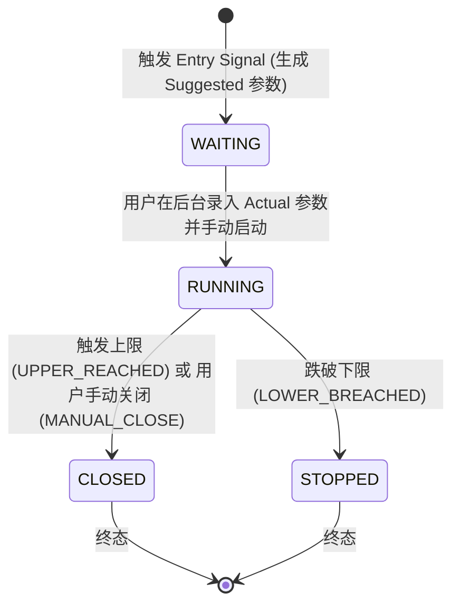

# NDX Grid & Option Alert System

一个基于 FastAPI + APScheduler + Pandas 的 **NDX 长多算术网格人工辅助提醒/监控系统**，同时保留 **传统 QQQ / LEAPS 期权全生命周期监控与提醒能力**。

> [!IMPORTANT]
> **定位与边界声明**：  
> 本系统为**人工辅助提醒与监控系统**，**不自动交易、不自动下单、不连接任何交易所 API、不自动平仓、不计算真实交易所 PnL 与强平点（Liquidation）**。系统的“理论网格状态”仅用于辅助提醒与决策参考，实际网格操作需由用户在交易所手动完成。

---

## 🌟 核心功能与策略

### 1. NDX 市场数据与指标分析 (`^NDX`)
- **数据源与链路**：通过 `yfinance` 定时获取 Nasdaq-100（`^NDX`）日线与实时行情数据。
- **技术指标**：实时计算 **RSI(14)**、**SMA200 移动平均线**、**1 年前收盘价（约 252 交易日）** 及均线连续站上天数（`is_above_sma200_3d`）。
- **数据新鲜度与 Stale 保护**：内置数据时效性防护机制。当市场数据过期（Stale）或无法获取时，系统遵循 **Fail-Closed（故障封闭）** 原则：冻结网格状态变更，避免产生错误开仓信号或异常触发。

### 2. 开仓信号逻辑 (Entry Signal)
当 NDX 满足以下 **3 个条件同时成立** 时，生成网格开仓信号（`NDX_GRID_ENTRY`）：
1. **RSI(14) < 35**（短期极度超卖）。
2. **连续 3 个交易日收盘价 > SMA200**（确认长期牛市趋势）。
3. **当前价格 > 约 1 年前收盘价**（确认中长线大趋势向上）。

> [!NOTE]
> 触发开仓信号后，系统自动生成一条 `WAITING` 状态的网格周期记录（Grid Cycle），并通过企业微信推送建议网格参数。

### 3. 建议网格参数 vs 实际网格参数 (Suggested vs Actual)
- **系统推荐默认参数 (Suggested Parameters)**：
  - 网格上限 (Upper)：基准价 $+20\%$
  - 网格下限 (Lower)：基准价 $-20\%$
  - 网格数量 (Grid Count)：200 格
  - 推荐杠杆 (Leverage)：5.0x
- **实际网格参数 (Actual Parameters)**：
  - 用户在交易所真实创建网格后，在后台管理界面录入并确认启动。
  - 一旦启动（进入 `RUNNING`），实际参数在整个 Cycle 生命周期内**永久冻结**，不受后续策略默认参数调整影响。

### 4. 网格状态机 (Grid State Machine)
网格周期遵循严格的单向状态机，避免状态混乱：



- **WAITING**：已生成开仓信号，等待用户在交易所开仓并在后台录入 Actual 参数。
- **RUNNING**：用户已确认启动，系统每 5 分钟监控现价与 Actual Upper / Lower 边界。
- **CLOSED / STOPPED**：终态（CLOSED 表示触及上限或手动关闭，STOPPED 表示跌破下限）。新周期必须等待旧周期完全结束后重新出现 Entry Signal 才会创建。

### 5. 定时监控与边界触发
- **监控频率**：APScheduler 每 **5 分钟** 轮询一次 NDX 最新价格。
- **边界判定规则**：
  - `current_price >= actual_upper_price` $\rightarrow$ **CLOSED** (原因: `UPPER_REACHED`)
  - `current_price < actual_lower_price` $\rightarrow$ **STOPPED** (原因: `LOWER_BREACHED`)
- **理论网格状态计算**：根据当前价格在网格区间内的相对位置，计算理论当前网格层级（`grid_interval_index`）与理论持仓比例（`position_ratio`），仅用于 Daily Report 和 Dashboard 提醒展示。

---

## 📅 可配置每日汇报 (Daily Report)

系统固定于美东时间交易日 **16:30** 执行每日汇报任务（`send_daily_report`）。支持在后台或环境变量中灵活切换 3 种模式：

### 1. 汇报模式说明
- **`off`**：关闭每日汇报推送。
- **`legacy`**（默认）：发送传统 **QQQ / LEAPS 期权市场感知日报**（展示 QQQ 现价、SMA200 距离、1年涨跌幅、RSI 及现存 LEAPS 期权持仓数），确保升级后向后兼容。
- **`ndx_grid`**：发送 **NDX Grid 专用日报**。包含：
  - NDX 现价、RSI14、SMA200、1 年前价格与数据状态（FRESH / STALE / UNAVAILABLE）
  - 开仓信号状态（YES / NO / NOT EVALUATED）
  - 当前策略参数（Upper/Lower 比例、Grid Count、Leverage）
  - 活动网格周期状态（WAITING 建议参数 / RUNNING 实际参数与理论位置 / CLOSED / STOPPED 终止原因）
  - 明确标注“理论状态仅用于提醒”的免责声明

### 2. 配置优先级 (Report Mode Priority)
系统读取 `daily_report_mode` 的优先级如下：
$$\text{数据库 Configuration.daily\_report\_mode} > \text{环境变量 DAILY\_REPORT\_MODE} > \text{默认 legacy}$$

---

## 🛡️ 保留功能：传统 QQQ / LEAPS 监控

NDX Grid 是新增的独立系统模块，系统**完全保留**了原有的 QQQ LEAPS 监控能力：
- **QQQ 信号监控**：继续定时追踪 QQQ 日线 RSI(14) 超卖与均线回归信号。
- **OptionPosition 仓位表与读取**：保留 `OptionPosition` 数据表及后台/Scheduler 对该表的读取与风控逻辑（阶梯止盈、DTE 90 天强制平仓、连续 3 天跌破 SMA200 止损）。
- **路由重定向**：旧的 `/admin/positions` 页面入口采用 HTTP 302 兼容重定向至 `/admin/grid`。

---

## 🖥️ 后台管理界面 (Admin UI)

系统提供轻量级 HTML 管理后台，使用 Session Cookie 进行权限认证：

- **`/admin/dashboard`**：综合仪表盘。显示 NDX 实时指标、当前 Grid 周期状态、理论持仓比例与旧版大盘感知卡片。
- **`/admin/grid`**：网格专项管理。查看 WAITING 待启动周期与 RUNNING 运行中周期，提供确认启动（录入 Actual 参数）与手动关闭按钮，以及历史周期列表。
- **`/admin/rules`**：策略规则与日报配置。可查看 NDX 策略阈值，并支持切换每日 16:30 的 Daily Report 模式（`off` / `legacy` / `ndx_grid`）。
- **`/admin/positions`**：旧持仓管理入口（HTTP 302 自动重定向至 `/admin/grid`）。
- **`/admin/logs`**：查看系统历史报警与推送日志。

---

## 🔐 安全与容错机制 (Fail-Safe & Security)

1. **绝对无自动执行**：系统不保存也不接入任何交易所 API Key，从物理上杜绝自动下单风险。
2. **Commit-Before-Notify（先落盘后通知）**：网格状态机变更是最高优先级事务，必须先成功 Commit 到 SQLite 数据库后再触发企业微信 Webhook 通知。若 Webhook 发送失败，**绝不回滚**已提交的数据库状态。
3. **Fail-Closed 数据保护**：行情接口异常或返回 Stale 数据时，定时任务自动跳过，不触发任何状态变更与误报。
4. **日志敏感信息脱敏 (Secret Redaction)**：自动对日志中的 Webhook `key=***` 等敏感 Token 进行正则脱敏，防止 Secret 泄露到控制台或日志文件。
5. **Scheduler Session 线程隔离**：每 5 分钟运行的 `check_ndx_grid_cycles` 和 16:30 运行的 `send_daily_report` 均显式传入 `db=None`，在任务内部自建并关闭独立的 `SessionLocal`，避免并发任务共享 Session 导致 SQLite 接口报错。
6. **SQLite 连接池规范**：生产环境 `engine` 不使用 `StaticPool`，确保多请求并发时的连接安全与事务隔离。
7. **任务异常隔离**：任何单个 Scheduler Job 发生的异常均被捕获并记录日志，不会导致主进程或其他线程停运。

---

## 📁 项目结构

```
LEAPS Option Alert/
├── app/
│   ├── admin/              # 后台管理界面 (模板与 Auth)
│   │   ├── templates/      # Jinja2 HTML 模板
│   │   └── auth.py
│   ├── alerts/             # 信号、网格数学与状态机
│   │   ├── dedup.py        # 去重逻辑
│   │   ├── grid_cycle.py   # 网格周期 CRUD 与状态流转
│   │   ├── grid_math.py    # 算术网格公式计算
│   │   ├── grid_monitor.py # 5分钟定时监控逻辑
│   │   ├── ndx_rules.py    # NDX 开仓规则
│   │   ├── option_rules.py # LEAPS 期权规则
│   │   └── qqq_rules.py    # QQQ 规则
│   ├── api/                # REST API
│   │   └── grid_api.py     # Grid 周期控制与 Dashboard 接口 (/api/grid/*)
│   ├── database/           # 数据库模型与初始化
│   │   ├── init_db.py
│   │   └── models.py       # SQLAlchemy ORM (GridCycle, Configuration 等)
│   ├── market/             # 行情数据获取
│   │   ├── data_fetcher.py # yfinance / Polygon 聚合
│   │   ├── polygon_client.py
│   │   └── yfinance_client.py
│   ├── notification/       # 消息通知
│   │   └── wechat.py       # 企业微信 Webhook 推送与脱敏
│   ├── scheduler/          # 定时任务
│   │   ├── jobs.py         # APScheduler 任务注册与调度
│   │   └── trading_hours.py# 美东美股交易时间判定
│   ├── services/           # 业务服务层
│   │   └── grid_service.py # Grid API/UI 核心服务封装
│   ├── config.py           # 配置读取 (Env & DB)
│   └── main.py             # FastAPI 应用入口与路由分发
├── tests/                  # 正式单元测试集
├── Dockerfile              # Docker 镜像构建配置 (Python 3.11)
├── docker-compose.yml      # 本地 Docker 开发配置
├── docker-compose.prod.yml # 生产环境 Docker 部署配置
├── requirements.txt        # Python 依赖清单
└── README.md
```

---

## ⚙️ 重要配置说明

主要配置可通过 `.env` 文件或数据库 `Configuration` 表进行设置：

| 配置项 | 环境变量项 | 默认值 | 作用与说明 |
| :--- | :--- | :--- | :--- |
| **企业微信 Webhook** | `WECHAT_WEBHOOK_URL` | `""` | 报警与 Daily Report 推送地址 |
| **Polygon API Key** | `POLYGON_API_KEY` | `""` | 备用/期权行情 API Key |
| **RSI 阈值** | `RSI_THRESHOLD` | `35.0` | NDX / QQQ 超卖判定阈值 |
| **默认网格上限比例** | `DEFAULT_GRID_UPPER_PCT` | `0.20` | 建议网格 Upper 上浮比例 (+20%) |
| **默认网格下限比例** | `DEFAULT_GRID_LOWER_PCT` | `0.20` | 建议网格 Lower 下浮比例 (-20%) |
| **默认网格格数** | `DEFAULT_GRID_COUNT` | `200` | 建议等差网格分格数量 |
| **默认网格杠杆** | `DEFAULT_GRID_LEVERAGE` | `5.0` | 建议网格杠杆倍数 |
| **每日汇报模式** | `DAILY_REPORT_MODE` | `"legacy"` | 可选 `off` / `legacy` / `ndx_grid` |

---

## 🚀 部署与运行

### 1. 本地 Python 运行

#### 环境要求
- **Python**: 3.11+

#### 步骤
```bash
# 1. 克隆仓库与创建虚拟环境
git clone <repository-url>
cd leaps-option-alert
python -m venv venv
source venv/bin/activate  # Windows: venv\Scripts\activate

# 2. 安装依赖
pip install -r requirements.txt

# 3. 配置文件准备
cp .env.example .env
# 编辑 .env 填写 WECHAT_WEBHOOK_URL 等必要参数

# 4. 启动服务
uvicorn app.main:app --host 0.0.0.0 --port 8000
```
启动后访问 `http://localhost:8000/setup` 初始化管理员密码，登录后进入 `/admin`。

---

### 2. Docker 部署（推荐）

使用 Docker Compose 一键启动后台与调度器：

```bash
# 1. 配置环境变量
cp .env.example .env

# 2. 构建并启动容器
docker compose up -d --build

# 3. 查看日志与服务状态
docker compose logs -f
docker compose ps
```

---

## 🧪 单元测试

项目包含完整的单元测试套件。

### 执行测试
运行以下命令执行正式单元测试集：

```bash
python -m unittest discover tests -p "test_*.py"
```

### 正式测试覆盖范围 (Phase 1–6)
正式测试集包含 8 个核心测试文件，共 **131/131** 测试用例全部 PASS：
- `tests/test_alerts.py`：基础警报与规则测试
- `tests/test_ndx_phase1.py`：NDX 市场数据与开仓信号测试
- `tests/test_grid_cycle_phase2.py`：网格状态机流转测试
- `tests/test_grid_phase3.py`：定时监控与 Fail-Closed 测试
- `tests/test_grid_phase4a.py`：Grid REST API 接口测试
- `tests/test_grid_phase4b.py`：Admin UI 与兼容重定向测试
- `tests/test_grid_phase5.py`：并发、落盘恢复与安全加固测试
- `tests/test_daily_report_phase6.py`：可配置每日汇报测试

> [!NOTE]
> `tests/` 目录下的诊断/手工验证脚本（如 `diagnose*.py`、`test_polygon*.py`、`test_wechat*.py` 等）为历史开发工具，不属于自动化构建测试。

---

## 📜 阶段演进历史 (Phase History)

- **Phase 1–3**: 引入 NDX 市场数据分析、算术网格逻辑、网格状态机与 5 分钟定时监控。
- **Phase 4A**: 引入 Grid REST API 接口 (`/api/grid/*`)，实现前后端分离的状态查询与操作控制。
- **Phase 4B**: 升级 Admin UI (`/admin/dashboard` 与 `/admin/grid`)，全面支持网格可视化与手动确认启动流程。
- **Phase 5**: 生产环境加固。解决 SQLite 并发、Scheduler Session 隔离、Commit-Before-Notify 及重启状态恢复。
- **Phase 6**: 可配置每日汇报系统。支持在 16:30 灵活切换 `off` / `legacy` / `ndx_grid` 模式。

---

## ⚠️ 系统限制 (Limitations)

1. **数据源依赖**：NDX 行情目前依赖 `yfinance`，非实时 Tick 级别数据，可能存在分钟级延迟；极短时间内接口异常时优先采取 Fail-Closed 机制跳过。
2. **日报 Dedup 作用域**：`DAILY_REPORT` 的去重 Key 目前保存在进程内存中。若在 16:30 日报发送前或发送后重启服务，当天再次到达汇报点时可能会重新发送一次。
3. **理论状态局限**：系统展示的理论网格收益、理论层级与持仓比例为基于等差网格模型的数学推算，不能等同于交易所的真实持仓或实际成交盈亏。
4. **无自动化交易**：系统不会也不可能代替用户执行下单或挂单，任何网格开仓与关闭均需人工操作。

---

## ⚖️ 许可证

MIT License
